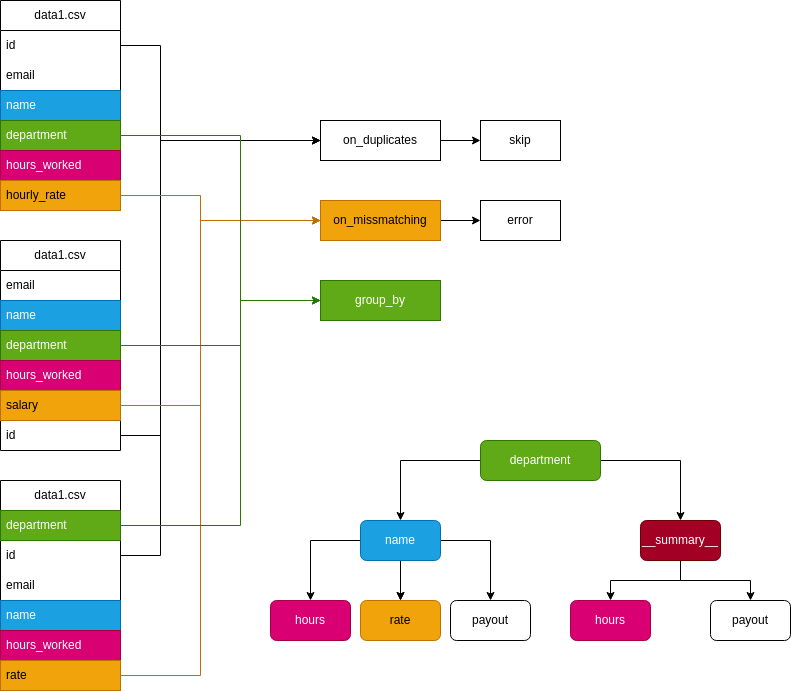

# Подсчёт зарплаты сотрудников

CLI сприпт для подсчёта зарплаты сотрудников

### Скачивание скрипта
```bash
git clone \
  --single-branch \
  --depth=1 \
  https://github.com/ames0k0/TT--Python--Calculate-employee-salaries

cd TT--Python--Calculate-employee-salaries
```

### Запуск скрипта
<details>
  <summary>Зависимости</summary>
  <pre>
python -V   # Python 3.12.3</pre>
</details>

Аргументы к скрипту
- Название и/или путь к файлам
- `--report` Название файла для записи результата
- `-h` Посмотреть справки скрипта


```bash
python main.py data1.csv data2.csv data3.csv --report payout
```

Пример входных данных
```csv
id,email,name,department,hours_worked,hourly_rate
1,alice@example.com,Alice Johnson,Marketing,160,50
```

Пример выходных данных
```json
{
    "Design": {
        "Alice": {
            "hours": 150,
            "rate": 40,
            "payout": "$6000",
        },
        "__summary__": {
            "hours": 150,
            "payout": "$6000",
        }
    }
}
```

> [!WARNING]
> Выбрасывает исключение в случае если:
> - Передан невалидный путь к файлам
> - Передан другой расширение файлов экспорта
> - Передан другой расширение файла для отчета
> - Передан генерации отчета не по `PAYOUT`
> - Отсутствуют необходимые колонки


### Тестирование скрипта

<details>
  <summary>Зависимости</summary>
  <pre>pytest -V   # pytest 8.3.5</pre>
</details>

<details>
  <summary>Создание среды разработки</summary>

  ```bash
  python -m venv .venv
  source .venv/bin/activate
  pip install -r dev_requirements.txt
  ```
</details>

```bash
pytest tests
```

```
Name                             Stmts   Miss  Cover
----------------------------------------------------
main.py                            177     12    93%
tests/__init__.py                    0      0   100%
tests/conftest.py                   20      0   100%
tests/test_report_generator.py      36      0   100%
tests/test_report_init.py           33      0   100%
----------------------------------------------------
TOTAL                              266     12    95%
```

---

<p align="center"></p>